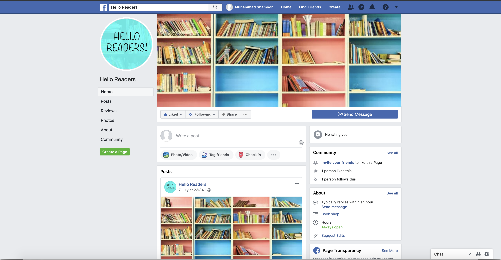

# Facebook Messanger Chatbot

## Facebook Page

This is the Facebook Page where the chatbot is deployed. But the chatbot is only accessible to the facebook account which have the role of Administrator/Developer/Tester. Because the app is in developement mode

Link: https://www.facebook.com/Hello-Readers-477284609504371/

## Deployment Server:

Used Heroku server for the deployment of Webhook created for Facebook Messenger.

Deployed Server Link: https://warm-tor-45494.herokuapp.com/

Heroku Installation on your machine:
1. brew tap heroku/brew && brew install heroku

Steps of Deployment

1. Goto the github branch of your working repository on your local machine.
2. login with your Heroku account by using the following command. (This command is for Mac Machine)
    $ heroku login 
3. Now deploy your changes to Heroku server by the following command
    $ git push heroku master
    
Note: Whenever you make any change on the local first commit and push it on your github branch, and then run the command mentioned on the step #3

## Dependencies:

1. Express.js
   npm install express body-parser --save
   
2. Installing GoodReads api node. (For accessing GoodReads api methods)
   npm install --save goodreads-api-node 
   
   You need to register your app to get a goodreads developer key With the developer key and secret you can now call goodreads().

## APIs Used:

1. https://graph.facebook.com/v3.3/me/messages

2. https://www.goodreads.com/book/show

3. GoodReads api methods exposed by installing GoodReads api node.

## Screenshots:

Facebook Page

1. User clicks on the messanger icon of the Facebook page, where chatbot is deployed. User is greeted with his first name, when the chat box is opened.

2. User pressed the 'Get Started' button and a message suddenly appears, with displaying two option below, asking the user to search for the books either by entering book's Goodreads Id or book's title. 

3. If the "Search by Title" option is checked, then user is asked to enter the title of the book.

4. If the correct title is entered, then maximum of 5 suggestions will appear below of the books which got searched on the basis of the title entered.

5. If user selects any of the books, then based on its reviews a suggestion will appear below that whether to make the purchase of the book or not.

6. With the above message, then user is given again an option to search for the book by entering the book's title or books Goodreads ID.

7. If user selects the option to search it by ID, then the user is asked to enter the Id of the book. And if correct Id is entered, then only that book will appear below. User will have the option to select that book and know its reviews, that whether to buy it or not.

8. If user did not enter the correct Goodreads Id of the book or a wrong title is entered which does not exist in goodreads record, then a message will appear with an apology that to we could not find the book the user wanted to search. He is then asked to make the search again

